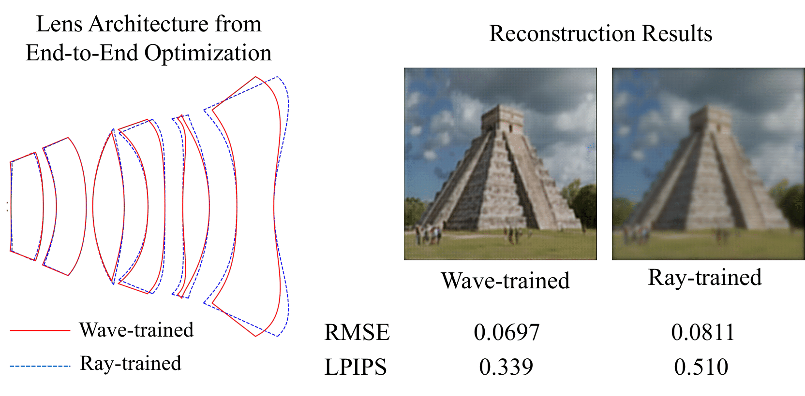

# A Differentiable Wave Optics Model for End-to-End Computational Imaging System Optimization

[](https://jerryhotaiwan.github.io/diff_wave_optics/)

📢 **This work has been accepted to ICCV 2025.**

---

<p align="center">
  
</p>

---

This repository provides a differentiable wave optics simulator for **point spread function (PSF) generation**, **image formation**, and **end-to-end optimization** of computational imaging systems.  
It is designed for research in computational imaging, holography, and optics-aware machine learning.

---

## Features

- **Differentiable Wave Optics Simulation**  
  Forward model with gradient support for optimization.

- **PSF Generation**  
  Simulate diffraction-limited or aberrated point spread functions.

- **Image Formation**  
  Render images under custom optical systems.

- **End-to-End Optimization**  
  Jointly optimize optical parameters and downstream tasks.

- **Config-Driven Pipeline**  
  All experiments are configured via JSON files for reproducibility.

---

## Installation

Clone the repository:
```bash
git clone https://github.com/JerryHoTaiwan/DeepWaveOptics.git
cd DeepWaveOptics
```

Create a virtual environment and install dependencies:
```bash
python -m venv .venv
source .venv/bin/activate   # Linux/Mac
.venv\Scripts\activate      # Windows

pip install -r requirements.txt
```

---

## Usage

### Run with a Config File
All experiments are controlled via JSON configs:
```bash
python main.py --config configs/experiments/example.json
```

### Example Config (`configs/experiments/example.json`)
```json
{
  "seed": 42,
  "use_deeplens": false,
  "lens_name": "example_lens.json",
  "system_scale": 1.0,
  "disp_wv": 550,
  "width": 10.0,
  "dim": 256,
  "psf_rad": 32,
  "blocks": ["generate_psf", "render_image", "optimize"]
}
```

---

## Project Structure

```
DeepWaveOptics/
├── configs/          # JSON configs (default/experiments/env)
├── src/              # Core implementation
│   ├── functions.py  # Callable blocks (PSF, render, optimize, etc.)
│   ├── utils.py      # Config + folder utilities
│   ├── main.py       # Entry point
│   └── initialization.py
├── results/          # Outputs (PSFs, images, logs, checkpoints)
└── README.md
```

---

## Examples

- **Generate PSFs**
```bash
python main.py --config configs/show_psfs.json
```

- **Render Images**
```bash
python main.py --config configs/display_triplet.json
```

- **End-to-End Optimization**
```bash
python main.py --config configs/train_cellphonelens.json
```

---

## Citation

If you use this code in your work, please cite:

```
@article{ho2024differentiable,
  title={A Differentiable Wave Optics Model for End-to-End Computational Imaging System Optimization},
  author={Ho, Chi-Jui and Belhe, Yash and Rotenberg, Steve and Ramamoorthi, Ravi and Li, Tzu-Mao and Antipa, Nicholas},
  journal={arXiv preprint arXiv:2412.09774},
  year={2024}
}
```

---

## License

MIT License © 2025 Chi-Jui (Jerry) Ho and contributors

---

## Acknowledgments

- UC San Diego Computational Imaging Lab  
- [DeepLens](https://github.com/singer-yang/DeepLens) and [DiffOptics](https://github.com/singer-yang/DeepLens) by Xinge Yang *et al.*  
  ```
  @article{yang2024end,
    title={End-to-End Hybrid Refractive-Diffractive Lens Design with Differentiable Ray-Wave Model},
    author={Yang, Xinge and Souza, Matheus and Wang, Kunyi and Chakravarthula, Praneeth and Fu, Qiang and Heidrich, Wolfgang},
    journal={arXiv preprint arXiv:2406.00834},
    year={2024}
  }
  ```
- Community feedback  
